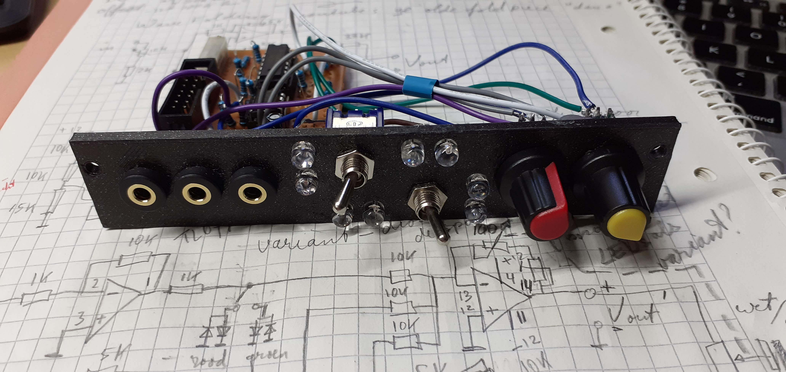

# Fold-O-Matic
Euro rack module for Wave Folding

This is a Euro Rack modelled WaveFolder, after Dan A's publication here: https://www.youtube.com/watch?v=QOMuaKNdtIk

Have a look at the video I made of the finished module: https://www.youtube.com/watch?v=wOnTNtAUl_A
You can find an STL-file to print the front panel and a KiCad schematic here as well.
